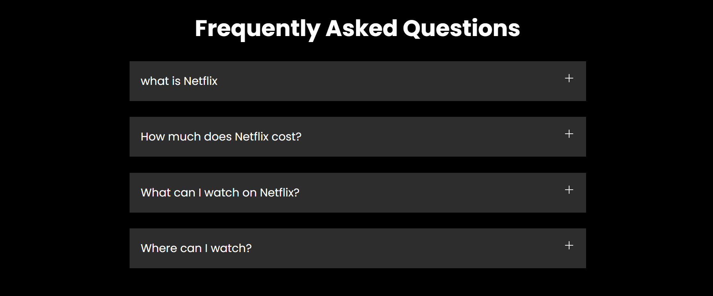

<h1 align="center">
  
  <br>
  Netflix Clone Built Using HTML & CSS
</h1>

<p><font size="3">
  This is a simple clone of the Netflix website built using <strong><em>HTML</em></strong> and <strong><em>CSS</em></strong>. It is a frontend project aimed at replicating the UI design of Netflix with a responsive and clean layout. While it does not have all the functionalities of the original Netflix, it showcases my ability to build a well-structured and styled website using HTML and CSS. The project includes the home page with a Netflix-like design.
  <br>
</p>

## Table of Contents

- [Project Walk-Through](#project-walk-through)
- [Home Page](#home-page)
- [Technologies Used](#technologies-used)
- [Installation](#installation)
- [Future Improvements](#future-improvements)
- [License](#license)

# Project Walk-Through

## Home Page

<div align="center"><a name="menu"></a>





</div>

## Technologies Used
- **HTML** – For structuring the webpage  
- **CSS** – For styling and layout  

## Installation
1. Clone the repository:  
   ```bash
   git clone https://github.com/karanainule/netflix-clone.git
